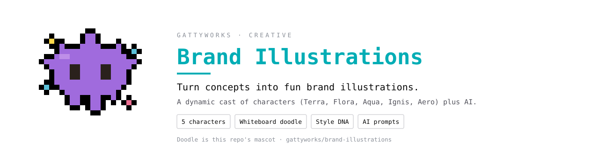
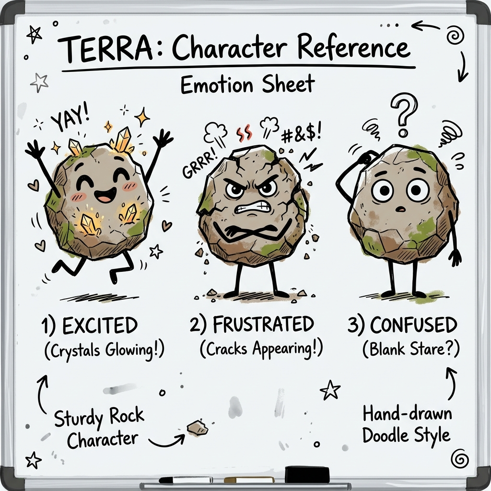

# Brand Illustrations Framework 🎨

Welcome to the **Brand Illustrations Framework**, a modular AI architecture designed to transform dry technical concepts into engaging, narrative-driven visual assets.

Whether you're writing technical documentation, blog posts, or creating YouTube thumbnails, this framework empowers your AI assistant (Codex, Antigravity, Claude, etc.) to automatically generate prompts featuring a consistent cast of characters in your exact brand style.

> [!NOTE]
> This framework works best when used with AI agents that have built-in **image generation capabilities** (like Codex or Antigravity). If your agent doesn't have image generation tools, it will output highly detailed text prompts that you can manually copy and paste into Midjourney, DALL-E, or other image generators.

---

## 🌟 The Core Concept

Unlike hardcoded illustration generators, this repository is built to be **dynamic** and **adaptable**. 

1. **You define the cast:** Provide markdown profiles of your characters in the [`characters/`](characters/README.md) folder.
2. **You define the style:** Set your line-art preferences, color palettes, and typography rules in the [`brand/`](brand/README.md) folder.
3. **The AI does the casting:** When you ask the AI to illustrate a concept (e.g., "API Rate Limiting"), the framework's internal logic reads your character files, analyzes their personalities and technical metaphors, and automatically "casts" the best characters for the job.

### Out-of-the-Box Defaults
The repository comes pre-loaded with a minimalist whiteboard doodle style and 5 elemental Gattyworks characters. You can use these immediately or replace them entirely with your own IP!

| Emoji | Character & Role | Visual Reference |
| :---: | :--- | :---: |
| 🌱 | **[Terra](characters/terra/README.md)** <br> The Earth (Foundation, Storage). *Features a specific GattyWorks Teal (#00ADB5) moss patch.* |  |
| 🍃 | **[Flora](characters/flora.md)** <br> The Leaf (Growth, Branching) |  |
| 💧 | **[Aqua](characters/aqua.md)** <br> The Water (Flow, Pipeline) |  |
| 🔥 | **[Ignis](characters/ignis.md)** <br> The Flame (Execution, Error) |  |
| ☁️ | **[Aero](characters/aero.md)** <br> The Cloud (Network, Floating) |  |

*(Click any character name to see their full profile and expression range!)*

---

## 🚀 Getting Started

### 1. Installation

To install the framework locally or inside your AI workspace, run the following commands:

**For macOS / Linux:**
```bash
git clone https://github.com/gattyworks/brand-illustrations.git
cd brand-illustrations
chmod +x install.sh
./install.sh
```

**For Windows:**
```cmd
git clone https://github.com/gattyworks/brand-illustrations.git
cd brand-illustrations
install.bat
```

> **AI Quick Setup:** You can also ask your AI assistant to run the setup for you. Simply paste: *"Clone the repository https://github.com/gattyworks/brand-illustrations.git, read SKILL.md, and initialize the illustration environment."*

### 2. Usage

Once installed, simply command your AI to use the framework:
- **For a Square Image (1:1):** `Use the brand-illustrations skill to create a square image explaining database caching.`
- **For a Banner Image (16:9):** `Use the brand-illustrations skill to create a banner thumbnail for a video about serverless deployment.`

---

## 🛠 Customizing Your Brand

The true power of this framework is making it your own. You can customize the entire output by editing two core areas:

### [The Character Roster (`/characters`)](characters/README.md)
Every character gets their own markdown file. Use [`_template.md`](characters/_template.md) to create new characters. For each character, you define:
- **Visuals:** Shape, size, and defining features.
- **Metaphors:** What technical concepts do they represent? (e.g., A rock represents databases, a lightning bolt represents speed).
- **Expressions:** How do they look when excited, frustrated, or confused?
- **Visual References:** Embed reference images so the AI can mimic their exact design!

### [The Brand DNA (`/brand`)](brand/README.md)
- **[`style-dna.md`](brand/style-dna.md)**: Update this file to change the visual aesthetic (e.g., from minimalist doodles to 3D renders, pixel art, or corporate flat vectors).
- **[`composition-patterns.md`](brand/composition-patterns.md)**: Define how much negative space is needed, where text should go, and how the canvas should be structured.

---

## ⚙️ [System Architecture (`/system`)](system/README.md)

The framework operates through a set of internal rules:
- **[`prompt-template.md`](system/prompt-template.md):** Translates the AI's logic into specific, structured prompts for image generation models (like Midjourney or DALL-E).
- **[`qa-checklist.md`](system/qa-checklist.md):** Ensures the AI validates its character selection, composition rules, and brand alignment before finalizing an image prompt.

---

## 🖼️ [Generated Examples (`/examples`)](examples/README.md)

Check out the `examples/` directory to see proof-of-concept illustrations generated by the framework.

---

## 🤝 Community & Support

We'd love to see the custom characters and styles you build with this framework!
- Found a bug or have a feature request? Open an **Issue**.
- Want to share your custom character templates? Open a **Pull Request**.
- Have questions? Start a **Discussion**.

Please review our [`CONTRIBUTING.md`](CONTRIBUTING.md) guidelines before participating.

**License:** MIT License (See `LICENSE` file for details).
