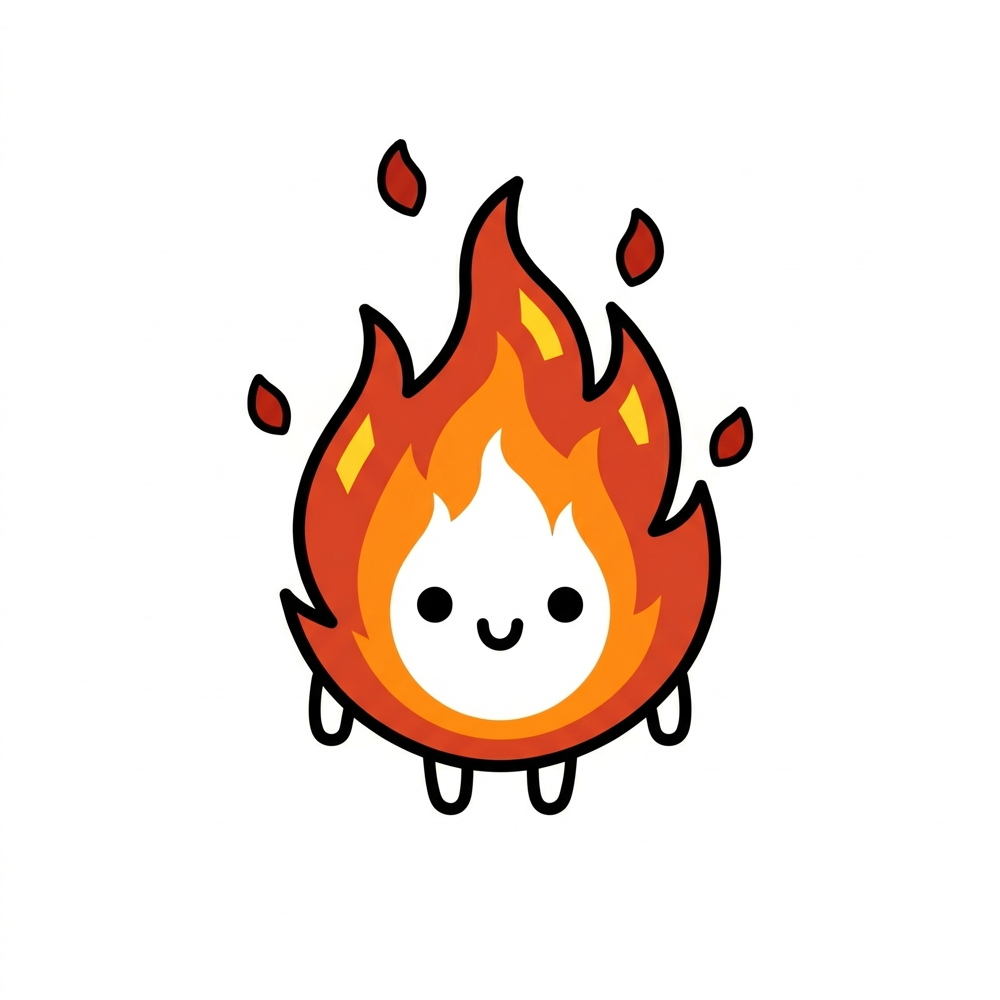
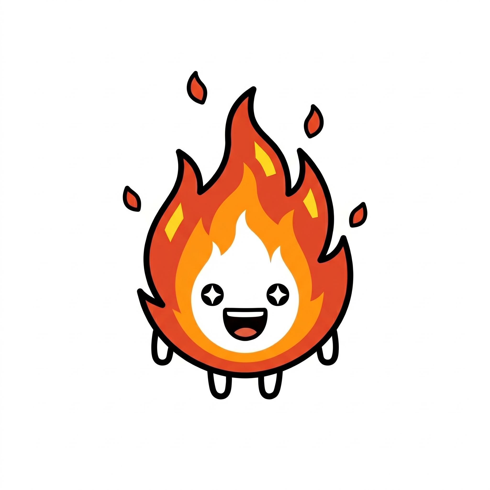
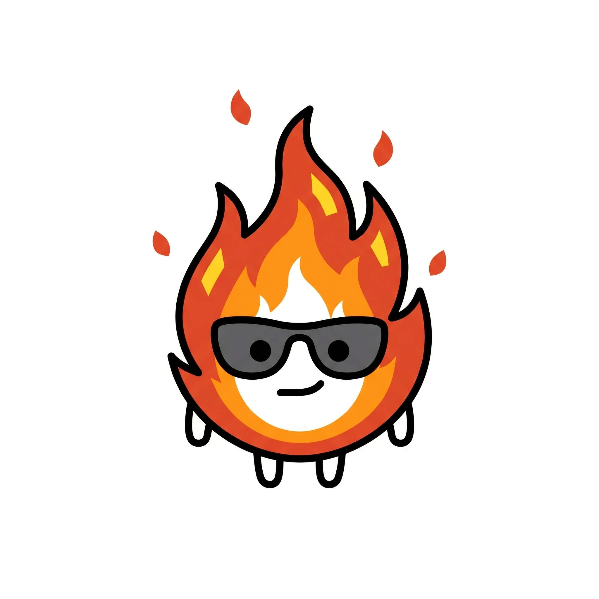
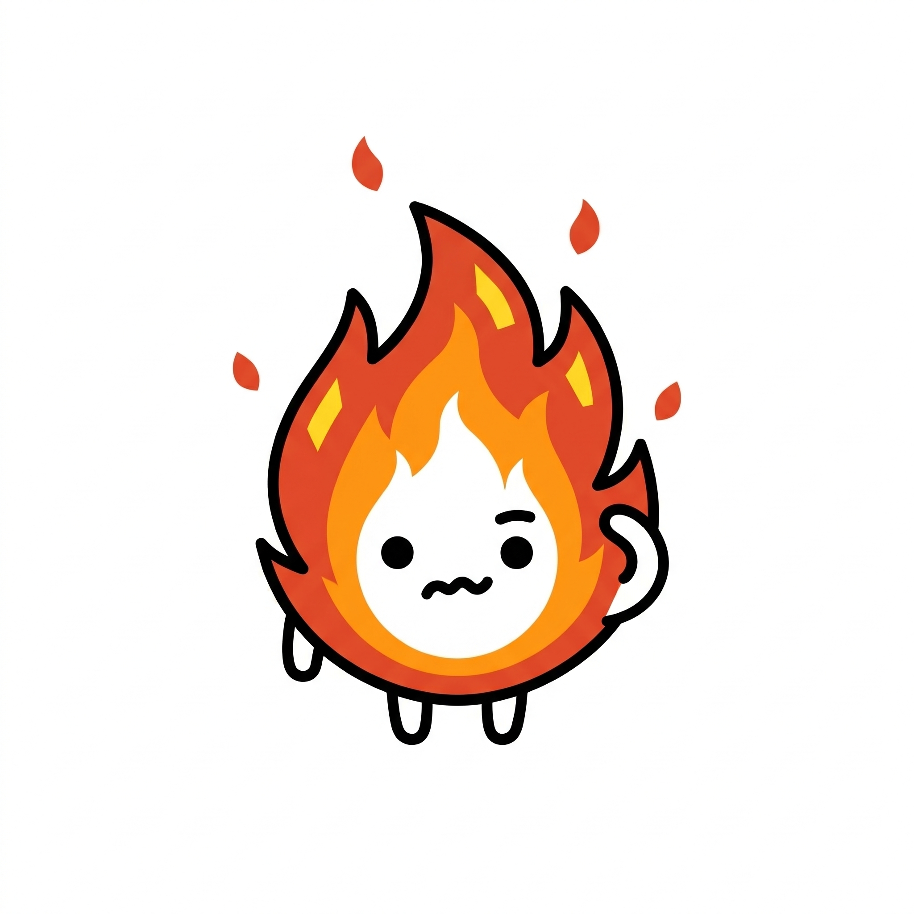
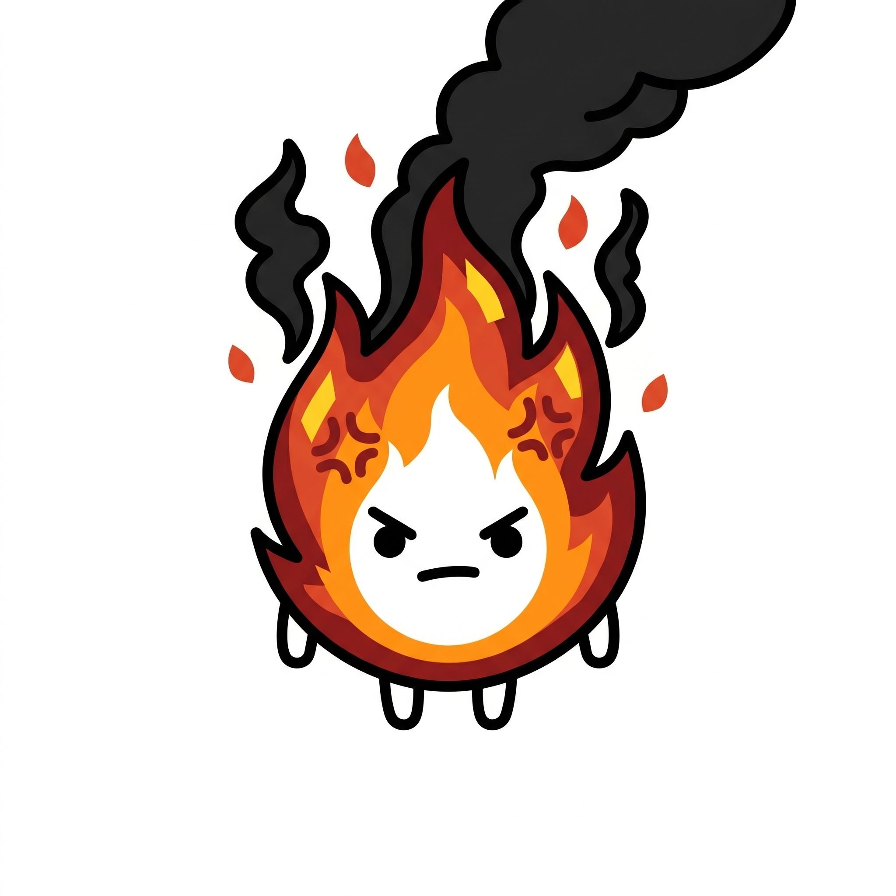
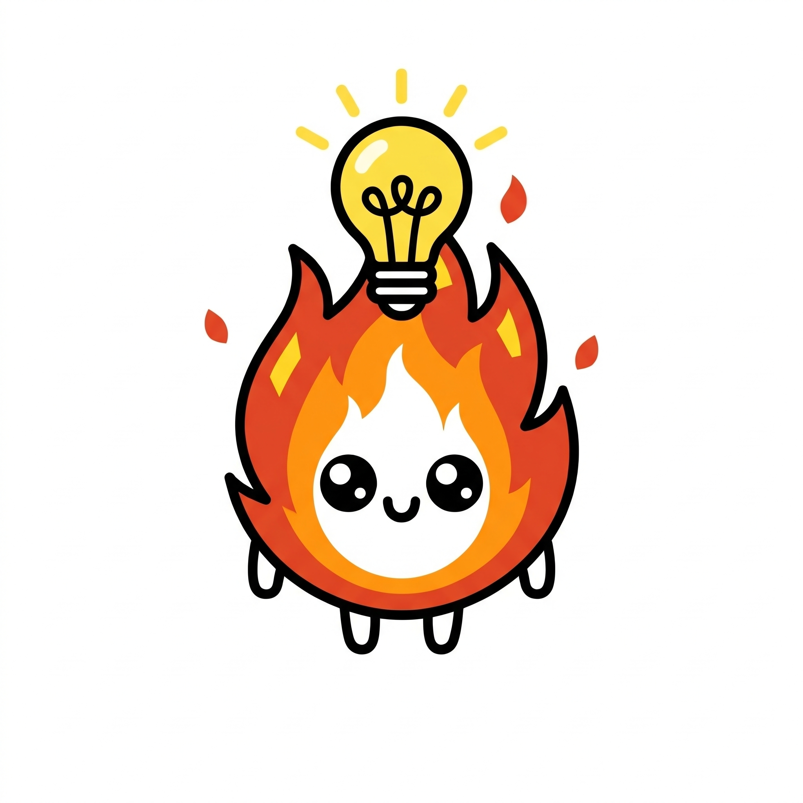
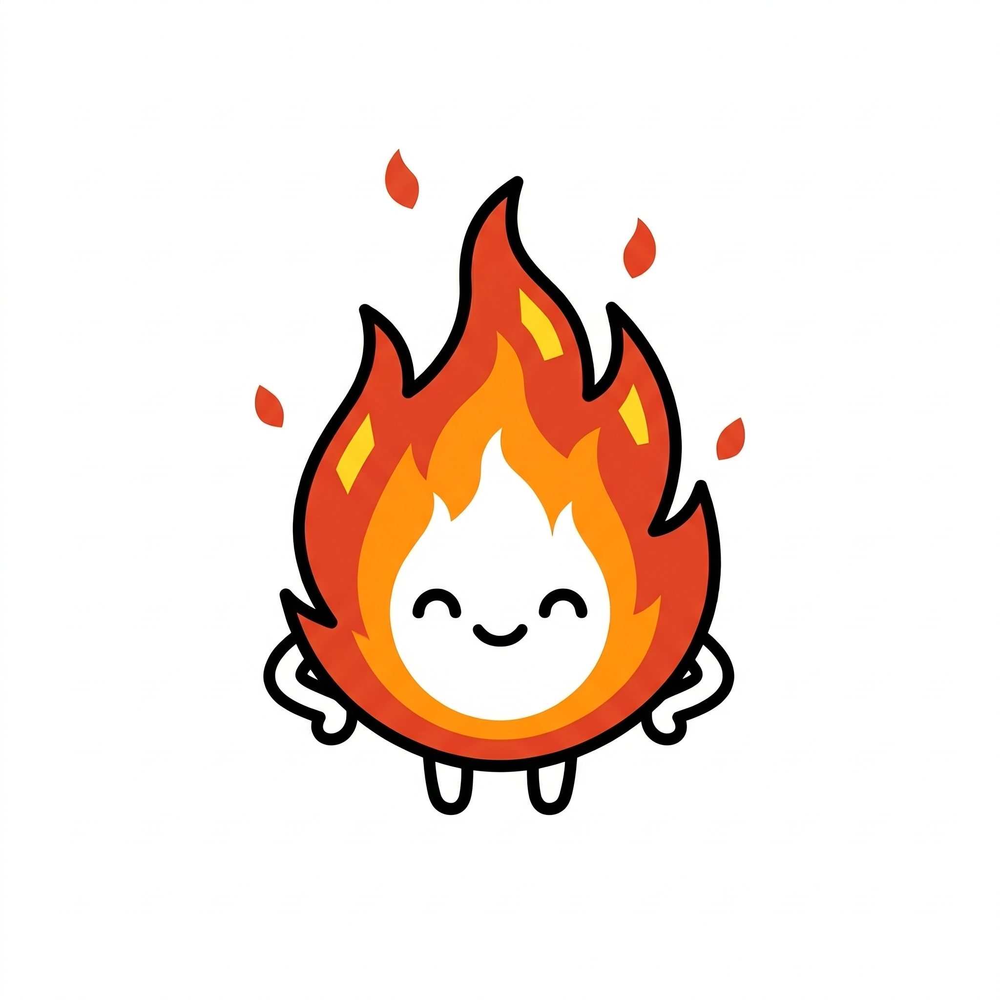
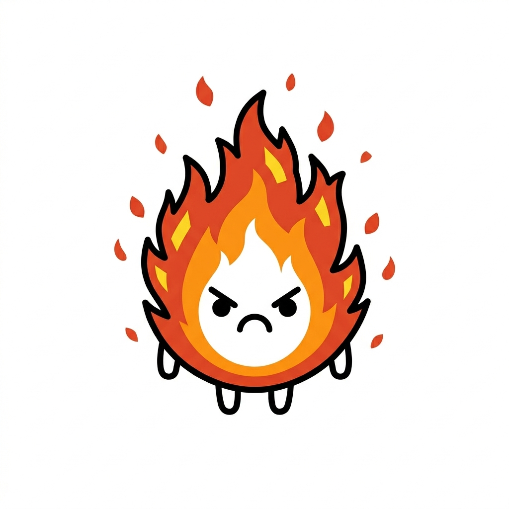
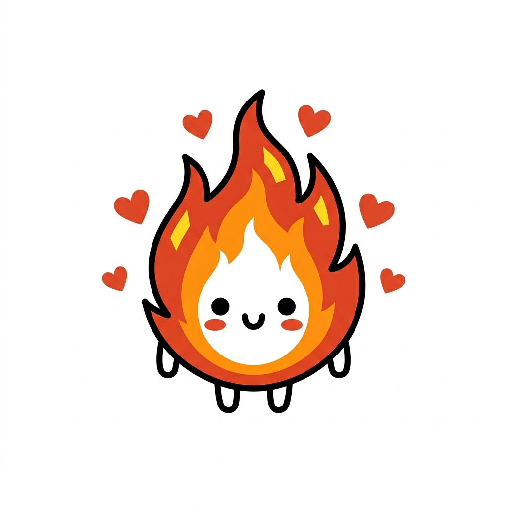

# Ignis Reference Images

This directory contains the generated expression reference images for **Ignis** (The Flame). These images act as ground-truth references for the strict minimalist style and warm red/orange/yellow core colors.

### Core Expressions

| Emotion | Reference | Emotion | Reference |
| :--- | :---: | :--- | :---: |
| **✨ Reference** |  | **😆 Excited** |  |
| **😎 Confident** |  | **😕 Confused** |  |
| **😤 Frustrated** |  | **💡 Eureka** |  |
| **😊 Proud** |  | **😴 Sleepy** |  |
| **😨 Scared** |  | **😏 Mischievous**|  |
| **😢 Crying** |  | **😠 Angry** |  |
| **🥰 Loving** |  | | |
