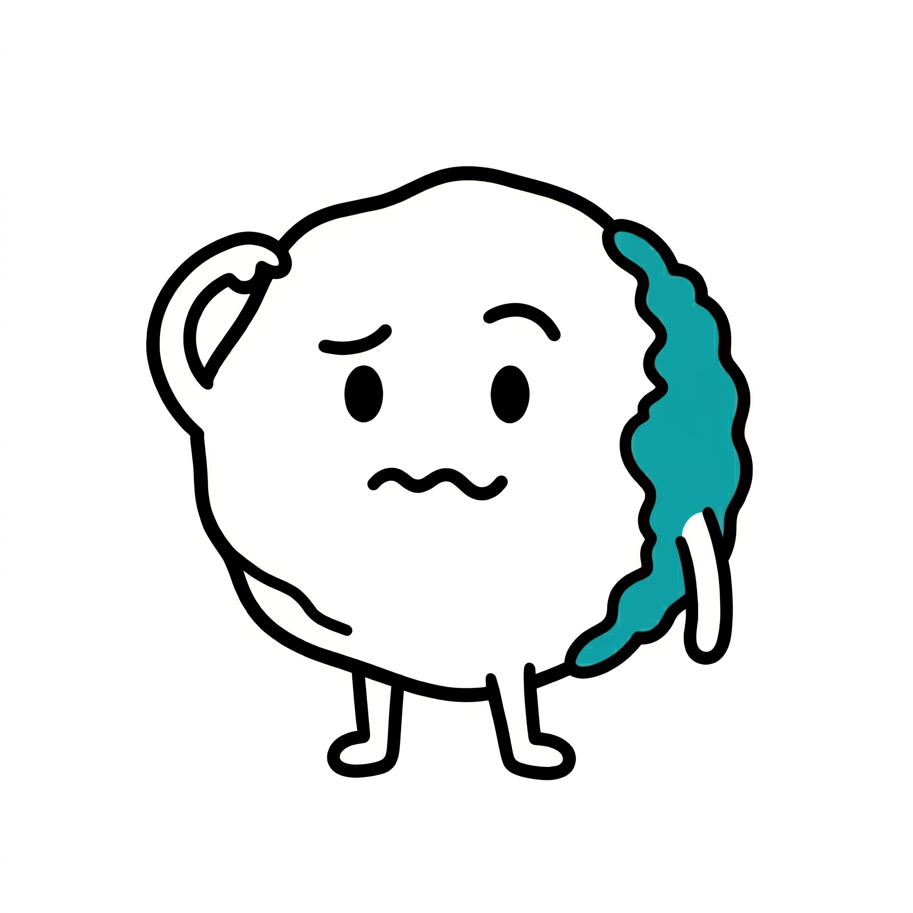
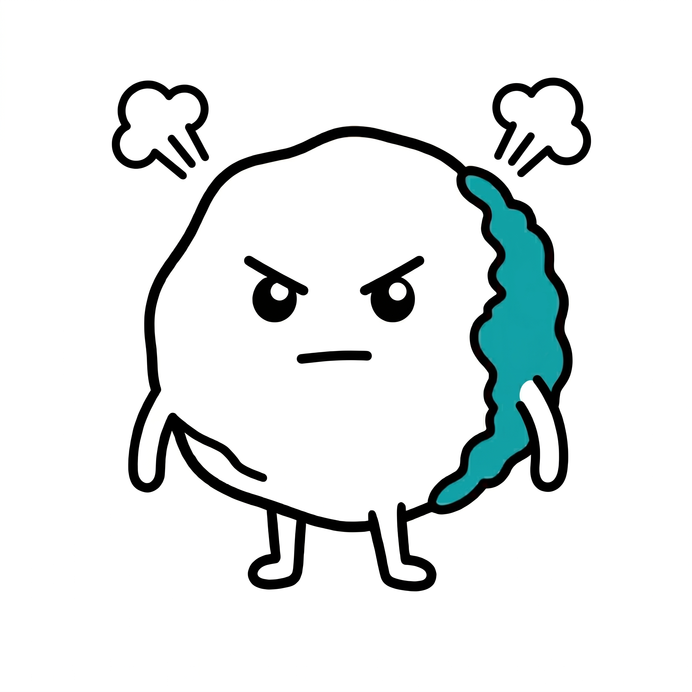
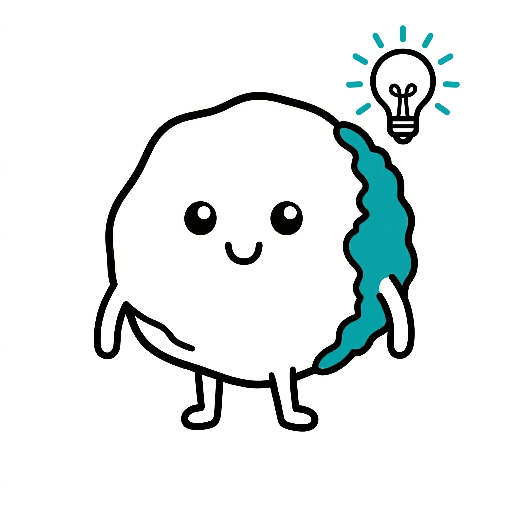
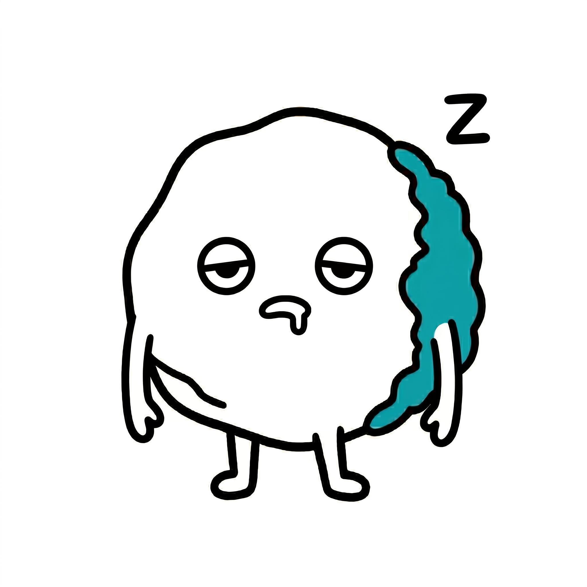
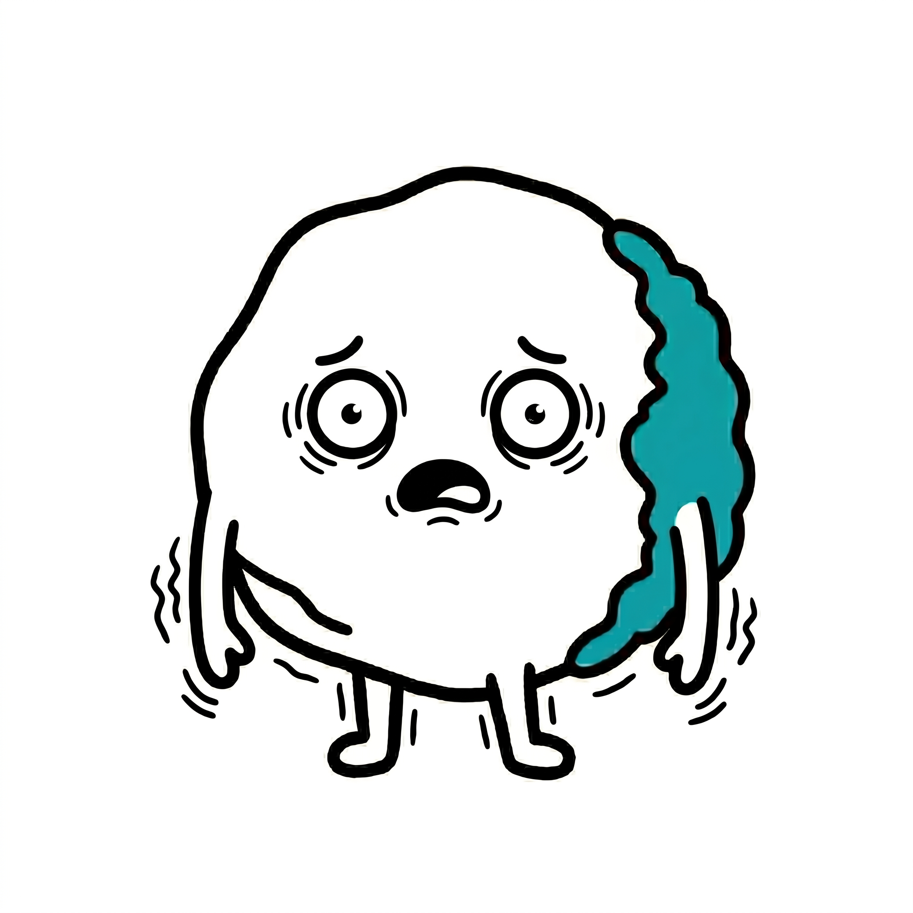
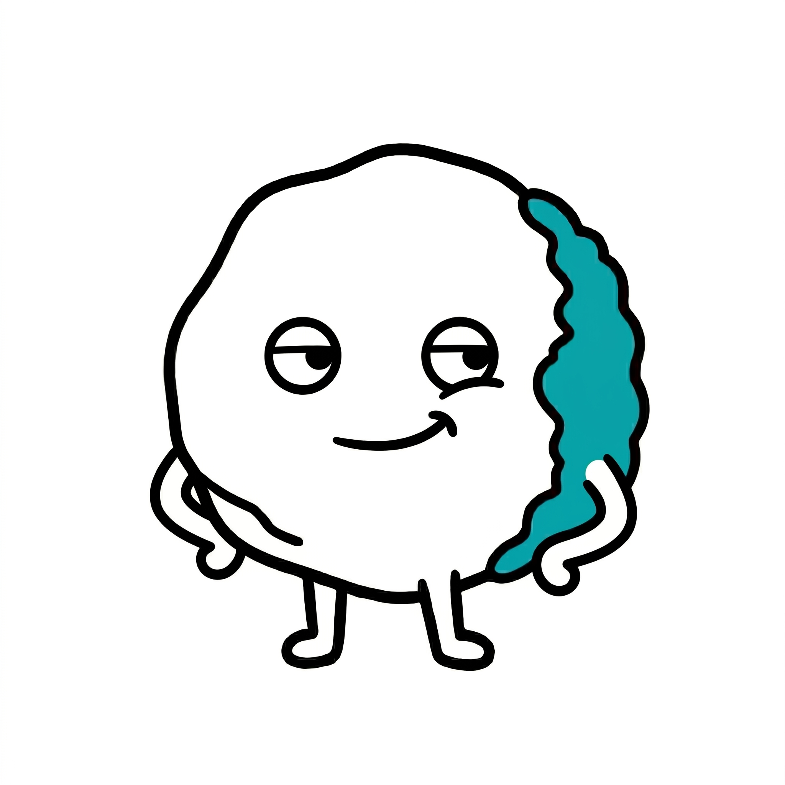
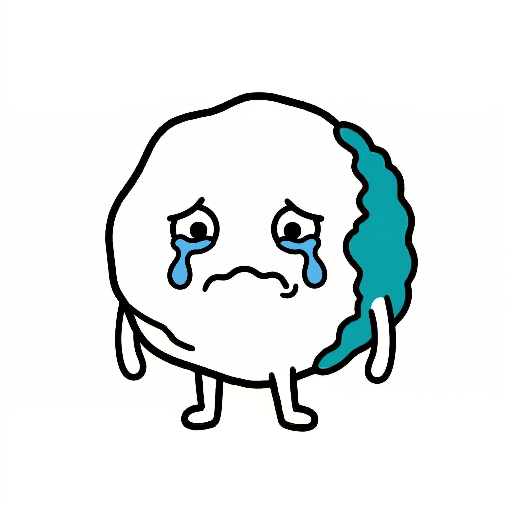
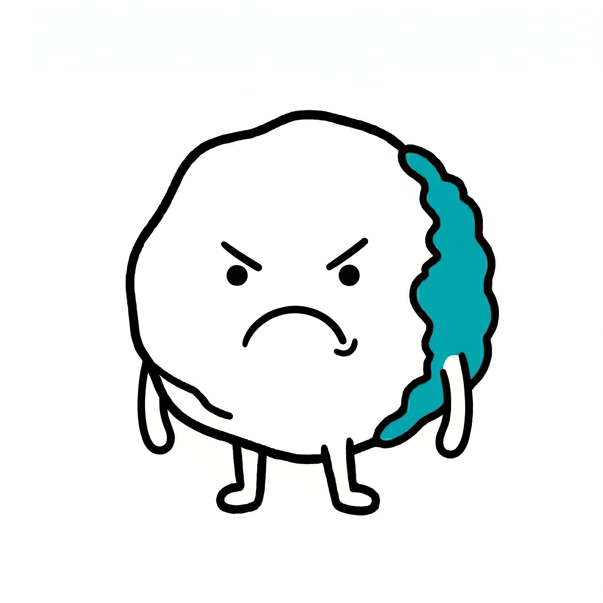
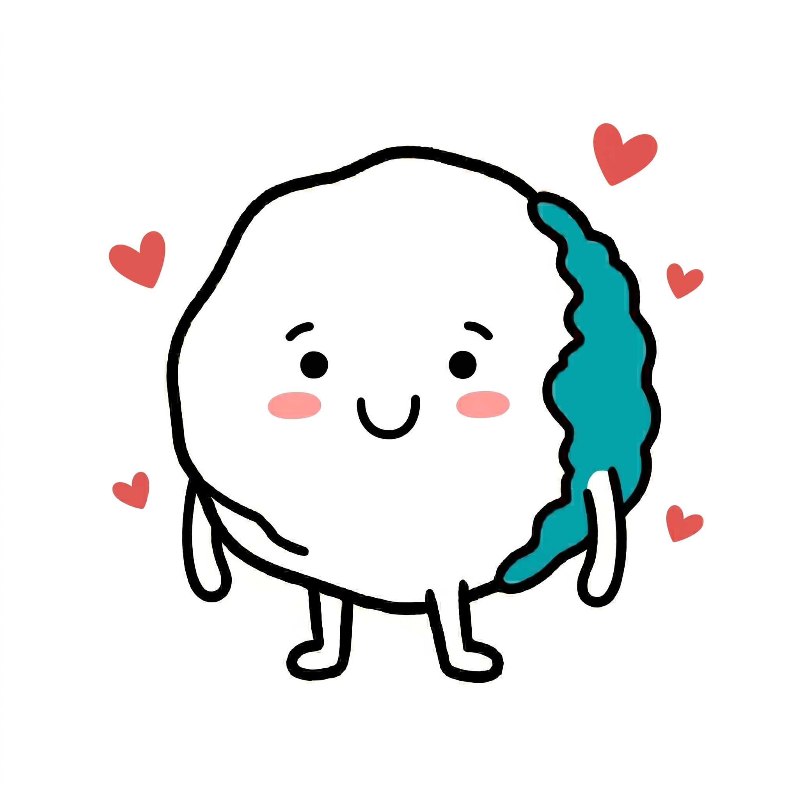

# Terra Reference Images

This directory contains the generated expression reference images for **Terra** (The Earth). These images act as ground-truth references for the strict minimalist style and `#00ADB5` moss color.

### Core Expressions

| Emotion | Reference | Emotion | Reference |
| :--- | :---: | :--- | :---: |
| **😆 Excited** |  | **😎 Confident** |  |
| **😕 Confused** |  | **😤 Frustrated** |  |
| **💡 Eureka** |  | **😊 Proud** |  |
| **😴 Sleepy** |  | **😨 Scared** |  |
| **😏 Mischievous**|  | **😢 Crying** |  |
| **😠 Angry** |  | **🥰 Loving** |  |
